# 🌾 AgroChain: Blockchain-Based Supply Chain Transparency for Agricultural Produce

AgroChain is a **blockchain-powered platform** designed to ensure **transparency, traceability, and trust** in the agricultural supply chain.  
It allows farmers, distributors, retailers, and customers to interact seamlessly while recording every step on a **tamper-proof blockchain**.

---

## 🚀 Features

- 🔗 **Blockchain Transparency** – Track produce from farm to consumer.  
- 📱 **QR Code Integration** – Each crop batch gets a scannable QR code.  
- 👨‍🌾 **Role-Based Access** – Farmer, Distributor, Retailer, and Customer workflows.  
- 📊 **Data Insights** – Firebase integration for storing activity logs.  
- 🎨 **Responsive UI** – Clean and modern design with Indian theme support.  
- ✅ **End-to-End Traceability** – Every step is verifiable on-chain.  

---

## 🛠️ Tech Stack

- **Frontend**: HTML, CSS, JavaScript  
- **Blockchain**: Hardhat (Ethereum)  
- **Backend/Database**: Firebase  
- **Smart Contracts**: Solidity  
- **Others**: QR Code Generator, PowerShell setup launcher  

---

## 📂 Project Structure

```bash
AgroChain/
│── contracts/           # Solidity Smart Contracts
│── scripts/             # Deployment scripts
│── frontend/            # UI code (HTML, CSS, JS)
│── firebase/            # Firebase integration files
│── AgroChain-Launcher.ps1  # Auto setup script
│── README.md            # Documentation
```

---

## ⚙️ Installation & Setup

### 1️⃣ Clone Repository
```bash
git clone https://github.com/your-username/AgroChain.git
cd AgroChain
```

### 2️⃣ Run Setup Script
For Windows:
```powershell
AgroChain-Launcher.ps1
```

This will:
- Check & install prerequisites  
- Start Hardhat blockchain  
- Deploy smart contracts  
- Initialize Firebase + frontend  

---

## 📞 Detailed Workflow

```mermaid
flowchart LR
    %% System Setup
    A[🚀 AgroChain-Launcher.ps1] --> B[🔧 Check Prerequisites]
    B --> C[📦 Install Dependencies]
    C --> D[⛓️ Start Hardhat Blockchain]
    D --> E[📝 Deploy Smart Contract]
    E --> F[🔥 Init Firebase + Frontend]
    F --> G[✅ System Ready]

    %% Roles in parallel
    G --> F1[👨‍🌾 Farmer Login]
    G --> D1[🚛 Distributor Login]
    G --> R1[🏪 Retailer Login]
    G --> C1[👥 Customer Access]

    %% Farmer
    F1 --> F2[📝 Add Crop Details]
    F2 --> F3[💾 Save Draft + Connect Wallet]
    F3 --> F4[⛓️ Register Crop on Blockchain]
    F4 --> F5[📱 Generate & Attach QR Code]

    %% Distributor
    D1 --> D2[📝 Scan QR + Add Transport]
    D2 --> D3[⛓️ Update Blockchain]
    D3 --> D4[🚚 Product in Transit]

    %% Retailer
    R1 --> R2[📝 Scan QR + Add Store Info]
    R2 --> R3[⛓️ Update Blockchain]
    R3 --> R4[🛒 Product Available]

    %% Customer
    C1 --> C2[🔍 Scan QR + View History]
    C2 --> C3[✅ Verify Authenticity]
    C3 --> C4[🛍️ Purchase Decision]

    %% Success & Monitoring
    C4 --> S1[📊 Data to Firebase + Blockchain]
    S1 --> S2[📈 Metrics & Transparency]
    S2 --> S3[🎯 Trust & System Success]

    %% Colors
    style A fill:#ffcc80,stroke:#e65100,stroke-width:2px
    style F4 fill:#81c784,stroke:#1b5e20,stroke-width:2px
    style D3 fill:#81c784,stroke:#1b5e20,stroke-width:2px
    style R3 fill:#81c784,stroke:#1b5e20,stroke-width:2px
    style C2 fill:#64b5f6,stroke:#0d47a1,stroke-width:2px
    style S3 fill:#4db6ac,stroke:#004d40,stroke-width:2px
```



---


---

## 🤝 Contributing

1. Fork the project  
2. Create your feature branch (`git checkout -b feature-name`)  
3. Commit changes (`git commit -m 'Add feature'`)  
4. Push to branch (`git push origin feature-name`)  
5. Open a Pull Request  

---

## 📜 License

This project is **open-source** under the MIT License.  

---

## ✨ Authors

- 👨‍💻 Sanskar + Team  

---

## ⭐ Support

If you find this project useful, **leave a star ⭐ on GitHub** to support future development!  
