# 🌾 AgriChain - Blockchain-Integrated Supply Chain System

AgriChain is a **blockchain-powered agricultural supply chain system** that ensures **farm-to-table transparency** using smart contracts, QR codes, and role-based dashboards.  

---

## 🏗️ System Architecture

### Components
1. **Smart Contract** (`AgriChain.sol`) - Deployed on blockchain  
2. **Frontend UI** - React application with role-based dashboards  
3. **Blockchain Service** - Web3 integration layer  
4. **QR Code System** - Product tracking and verification  

### User Roles
- 🌱 **Farmers** → Register crops on blockchain, generate QR codes  
- 🚛 **Distributors** → Update transport info, add handling costs  
- 🏪 **Retailers** → Add retail margins, store details  
- 👥 **Customers** → Scan QR codes, view complete transparency  

---

## 📊 Supply Chain Overview

```mermaid
flowchart LR
    Farmer[🌱 Farmer] --> Distributor[🚛 Distributor]
    Distributor --> Retailer[🏪 Retailer]
    Retailer --> Customer[👥 Customer]
    Customer -->|Scan QR| Product[📦 Blockchain Product History]
```



---

## 📞 Detailed Workflow

```mermaid
flowchart TD
    %% System Setup
    A[🚀 AgroChain-Launcher.ps1] --> B[🔧 Check Prerequisites]
    B --> C[📦 Install Dependencies]
    C --> D[⛓️ Start Hardhat Blockchain]
    D --> E[📝 Deploy Smart Contract]
    E --> F[🔥 Init Firebase + Frontend]
    F --> G[✅ System Ready]

    %% Farmer Stage
    G --> F1[👨‍🌾 Farmer Login]
    F1 --> F2[📝 Add Crop Details]
    F2 --> F3[💾 Save Draft + Connect Wallet]
    F3 --> F4[⛓️ Register Crop on Blockchain]
    F4 --> F5[📱 Generate & Attach QR Code]

    %% Distributor Stage
    F5 --> D1[🚛 Distributor Scans QR]
    D1 --> D2[📝 Add Transport + Costs]
    D2 --> D3[⛓️ Update Blockchain]
    D3 --> D4[🚚 Product in Transit]

    %% Retailer Stage
    D4 --> R1[🏪 Retailer Scans QR]
    R1 --> R2[📝 Add Store Details + Margin]
    R2 --> R3[⛓️ Update Blockchain]
    R3 --> R4[🛒 Product Available]

    %% Customer Stage
    R4 --> C1[👥 Customer Scans QR]
    C1 --> C2[🔍 View History + Price Breakdown]
    C2 --> C3[✅ Verify Authenticity]
    C3 --> C4[🛍️ Purchase Decision]

    %% Success & Monitoring
    C4 --> S1[📊 Data to Firebase + Blockchain]
    S1 --> S2[📈 Metrics & Transparency]
    S2 --> S3[🎯 Trust & System Success]

    style A fill:#ffcc80,stroke:#e65100,stroke-width:2px
    style F4 fill:#81c784,stroke:#1b5e20,stroke-width:2px
    style D3 fill:#81c784,stroke:#1b5e20,stroke-width:2px
    style R3 fill:#81c784,stroke:#1b5e20,stroke-width:2px
    style C2 fill:#64b5f6,stroke:#0d47a1,stroke-width:2px
    style S3 fill:#4db6ac,stroke:#004d40,stroke-width:2px
```



---

## 🚀 Quick Start Guide

### 1. Prerequisites
- Node.js installed  
- MetaMask browser extension  
- Local blockchain running (Hardhat)  

### 2. Smart Contract Deployment
```bash
cd Blockchain/seed-to-shelf-flow-main/smart-contracts
npm install
npx hardhat node
npx hardhat run deploy.js --network localhost
```

### 3. Frontend Setup
```bash
cd frontendNbackend
npm install
npm run dev
```

### 4. MetaMask Configuration
- **Network Name:** Hardhat Local  
- **RPC URL:** http://127.0.0.1:8545  
- **Chain ID:** 31337  
- **Currency Symbol:** ETH  

---

## 📱 How to Use

### 🌱 Farmer
1. Login & connect MetaMask  
2. Add crop details → Register on blockchain  
3. Generate QR code → Attach to product  

### 🚛 Distributor
1. Scan QR code from farmer  
2. Add transport details & handling costs  
3. Update blockchain  

### 🏪 Retailer
1. Scan distributor’s QR code  
2. Add store details & margin  
3. Update blockchain  

### 👥 Customer
1. Scan QR code on product  
2. View complete history & verify authenticity  

---

## 🔧 Key Features
- ✅ Blockchain integration (Hardhat + Web3 + MetaMask)  
- ✅ Immutable product history  
- ✅ Role-based dashboards  
- ✅ QR code generation & scanning  
- ✅ Real-time blockchain updates  

---

## 🔒 Security & Trust
- **Immutable Blockchain Records** – Cannot be altered or deleted  
- **Role-Based Access** – Farmers, distributors, retailers, customers  
- **Wallet Authentication** – MetaMask login  
- **Smart Contract Validation** – Ensures correct workflow order  

---

## 🌟 Benefits

### For Farmers
- Proof of authenticity  
- Better market access  
- Direct connection to consumers  

### For Distributors
- Transparent handling costs  
- Reduced disputes  
- Improved tracking  

### For Retailers
- Consumer trust  
- Premium pricing for verified products  
- Reduced liability  

### For Customers
- Complete transparency  
- Instant authenticity verification  
- Farm-to-table journey  

---

## 🛠️ Technical Implementation

### Smart Contract Functions
```solidity
// Farmer functions
registerProduct() - Register new crop
getProduct() - Get product details

// Distributor functions
updateAsDistributor() - Add transport info
getProductHistory() - Get transaction history

// Retailer functions
updateAsRetailer() - Add retail info

// Customer functions
verifyProduct() - Verify authenticity
```

### Frontend Services
- `blockchainService.ts` → Web3 integration  
- `qrCodeService.ts` → QR code generation & scanning  
- Role-based dashboards  

### Key Dependencies
- `ethers` – Ethereum interaction  
- `qrcode` – QR code generation  
- `html5-qrcode` – QR scanning  
- `sonner` – Notifications  

---

## 🔍 Troubleshooting

### Common Issues
1. **MetaMask not connecting** → Check network is Hardhat Local (31337)  
2. **Transaction failing** → Ensure correct status & enough ETH  
3. **QR not scanning** → Use manual Product ID entry  

### Contract Info
- Address: `0x0165878A594ca255338adfa4d48449f69242Eb8F`  
- Network: Localhost (Hardhat)  
- Chain ID: `31337`  

---

## 🎉 Success! Your System is Ready

AgriChain is now live with:  
✅ **Complete Transparency** – Farm-to-table traceability  
✅ **Immutable Records** – Blockchain storage  
✅ **QR Code Integration** – Easy scanning & verification  
✅ **Role-based Access** – Secure user management  
✅ **Real-time Updates** – Blockchain synchronization  

---

## 📸 Future Enhancements
- Add **demo screenshots** of dashboards  
- Deploy on **testnet (Goerli / Sepolia)**  
- Mobile app integration for QR scanning  

---

## 📞 Support

For technical issues:  
- Check MetaMask console logs  
- Ensure Hardhat node is running  
- Verify correct contract deployment  
- Retry with fresh wallet accounts  

---

**Happy Farming with Blockchain Transparency! 🌾🚛🏪👥**
